# 🗣️ Talk!

**[Talk](https://vysnvnt.com/talk/)** is a smart, fast, and modern chat app built with **Flutter** and **Firebase**, designed for seamless real-time communication. It supports **one-on-one messaging** and **group chats**, all packed into a clean, intuitive, and responsive user interface.

With features like profile customization, group creation, dark mode, and secure authentication, **Talk** offers a complete messaging experience that's both powerful and user-friendly.

> 🚀 The app is currently in version **v2.0.0**.

---

## ✨ Features Overview

### 🏠 Home Screen

- Displays a list of **all personal chats**.
- Each chat item shows:
  - User's **profile photo**
  - **Username**
  - **Email** as a subtitle
  - **Unread message count** badge (if applicable)
- A side **navigation drawer** is accessible for app-wide navigation.

---

### 💬 Personal Chat

- Real-time **one-on-one messaging** using **Firebase Firestore**.
- Chat screen includes:
  - App bar with **sender's profile photo** (clickable to view), **username**, and **email** as subtitle.
  - Live **auto-scrolling** to latest message.
- Message bubbles show:
  - Message text
  - Timestamp
  - Alignment based on sender (left/right)
- Long-press on a message shows options to:
  - **Report user**
  - **Block user**

---

### 👥 Group Chat

- Real-time **group messaging** powered by **Firebase Firestore**.
- Groups screen:
  - Displays all groups the user is part of.
  - Shows **"No groups found"** message if user isn’t in any group.
- Create group screen includes:
  - Input field for **group name**
  - Scrollable **user list** with:
    - Username
    - Email
    - Checkbox to select users
  - **Create Group** button to finalize creation
- Group chat screen:
  - App bar with **group name** and a **delete button** (for group admin)
  - Message bubbles show:
    - Sender's profile photo
    - Username
    - Message text
    - Timestamp
    - Proper alignment based on sender

---

### ⚙️ User Settings

- Customize your profile with:
  - Editable **username**
  - Optional **profile photo** (upload from gallery or delete)
- Settings include:
  - **Dark mode toggle** for theme switching
  - **Change username** with a hint showing current username
  - **Blocked users list** — view and unblock users
  - **Delete Account** button:
    - Permanently deletes user data from:
      - Firebase Auth
      - Firestore
      - Firebase Storage

---

### 🧭 Navigation Drawer

- Accessible via swipe or menu icon.
- Displays:
  - **Profile section**:
    - Profile photo
    - Username
    - Email
    - Real-time photo updates (supports fallback if photo is deleted)
  - Navigation options:
    - Home (Chats)
    - Groups
    - Settings
    - About
  - **Logout button**
- Designed with smooth transitions, shadows, and clean layout.

---

## 🔐 Firebase Integration

### 🔑 Authentication
- Firebase **Email & Password** authentication (Google sign-in coming soon)

### 🔥 Firestore Structure

#### 🔹 `users` collection
- Fields:
  - `email`
  - `profileImage`
  - `uid`
  - `uname`
- Subcollection:
  - `groups` → stores group IDs user is part of

#### 🔹 `chat_rooms` collection
- Each chatroom ID has a subcollection:
  - `messages`
    - Fields:
      - `message`
      - `timestamp`
      - `senderId`
      - `senderEmail`
      - `receiverId`
      - `uname`
      - `isRead`

#### 🔹 `groups` collection
- Each group ID has:
  - Subcollection: `messages` (same fields as above)
  - Fields:
    - `name` (group name)
    - `membersId` (list of user IDs)

---

## 🧠 Smart Behavior

- Deleted profile images update across all screens instantly.
- Home screen shows **unread message count markers** for personal chats.
- Full **real-time sync** with Firestore — no manual refresh needed.
- State management ensures:
  - Updated usernames and images reflect everywhere.
  - No stale or cached data after profile changes or deletions.

---

## 📦 Tech Stack

| Tool                | Purpose                              |
|---------------------|--------------------------------------|
| **Flutter**         | Cross-platform app development       |
| **Firebase Auth**   | User authentication & management     |
| **Firebase Firestore** | Real-time chat & group data       |
| **Firebase Storage**| Profile image uploads                |

---

## 🎨 App Design Philosophy

- Built with a **Material-first aesthetic**
- Responsive layouts for all screen sizes
- Smooth animations and UI transitions
- Clean separation of features and screens
- Prioritizes usability, speed, and clarity

---

## 🖼️ Branding

- Comes with a custom-designed **app icon/logo**
- UI themed for a sleek and modern look in both **light and dark modes**

---

## 🙌 Final Words

**Talk** is built for modern communication — balancing performance, simplicity, and community. Whether chatting one-on-one or managing group conversations, it offers everything you need, without the clutter.

---

## 📸 Screenshots

### 🔐 Login & SignUp Screen

<table>
  <tr>
    <td align="center">
      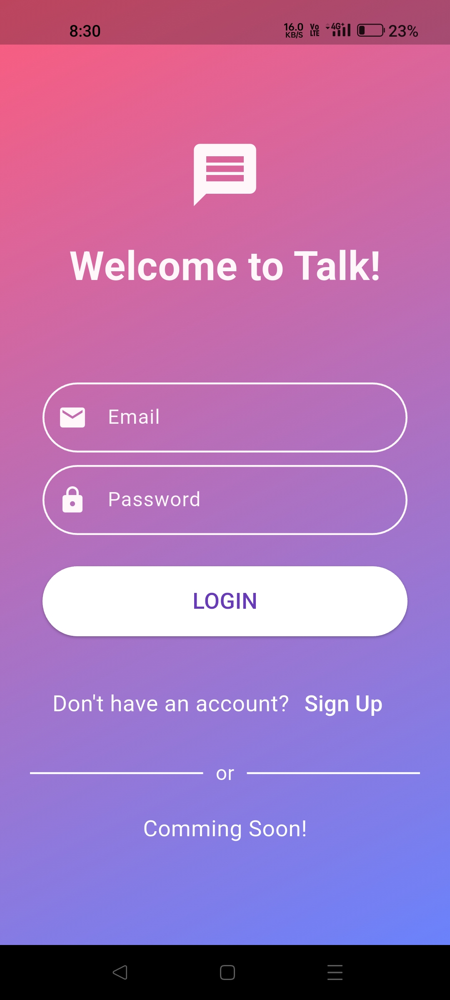 
      Login
    </td>
    <td align="center">
      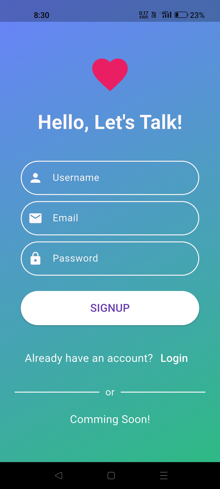 
      SignUp
    </td>
  </tr>
</table>

### 🏠 Home Screen

<table>
  <tr>
    <td align="center">
      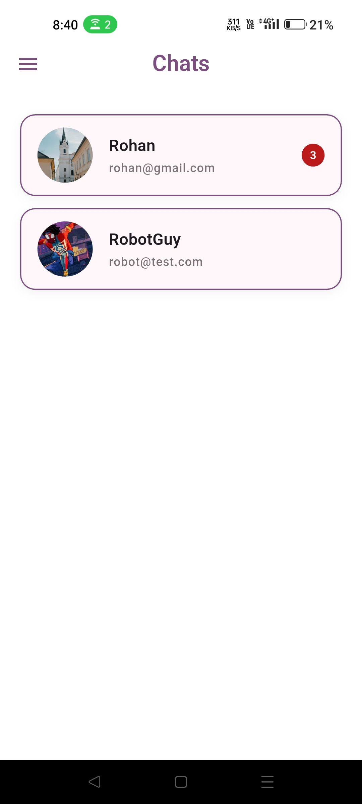 
      Light Mode
    </td>
    <td align="center">
      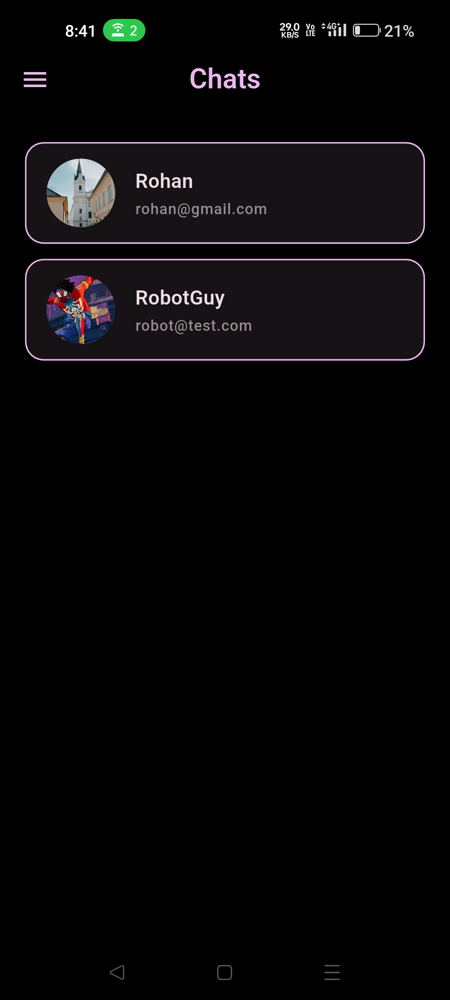 
      Dark Mode
    </td>
  </tr>
</table>

### 💬 Chat Screen

<table>
  <tr>
    <td align="center">
      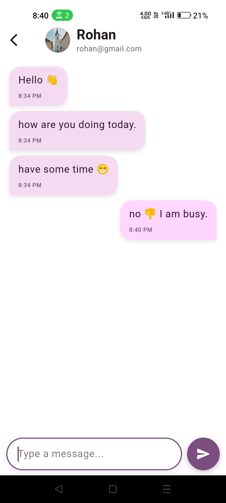 
      Light Mode
    </td>
    <td align="center">
      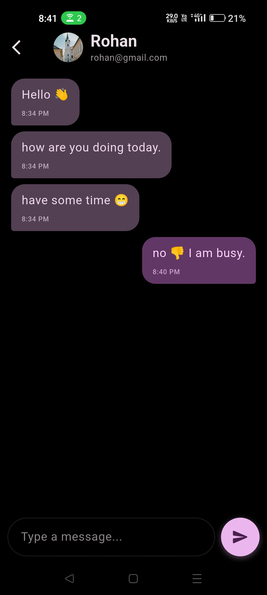 
      Dark Mode
    </td>
  </tr>
</table>

### 📂 App Drawer

<table>
  <tr>
    <td align="center">
      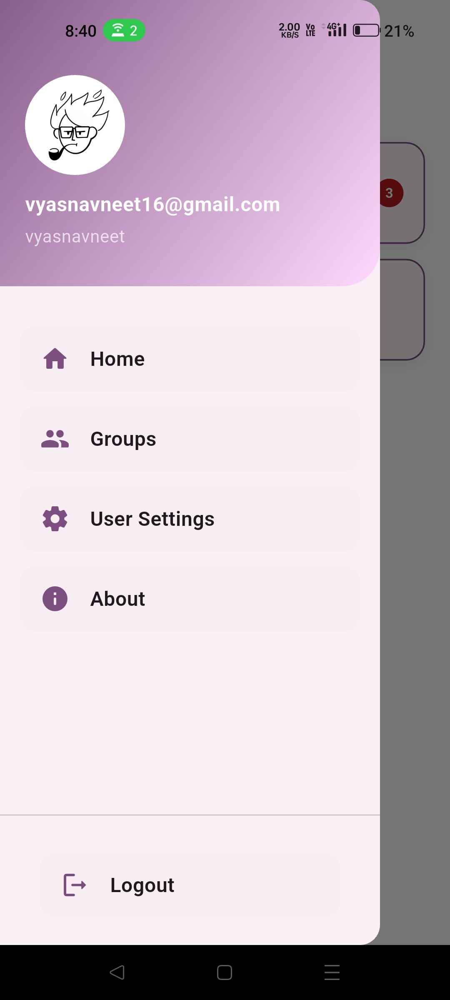 
      Light Mode
    </td>
    <td align="center">
      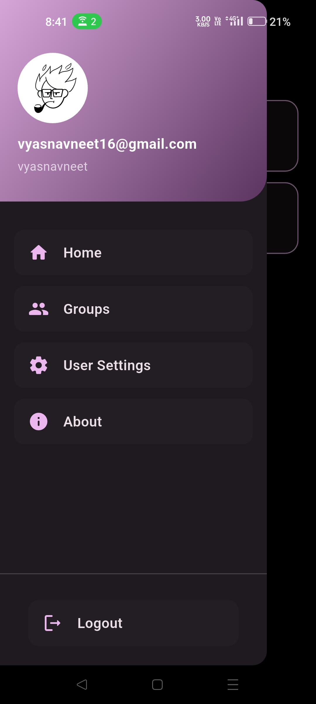 
      Dark Mode
    </td>
  </tr>
</table>

### ⚙️ Settings Screen

<table>
  <tr>
    <td align="center">
      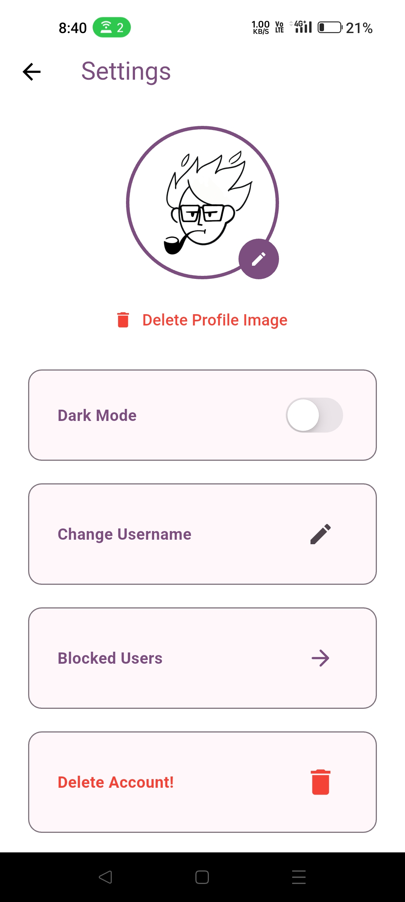 
      Light Mode
    </td>
    <td align="center">
      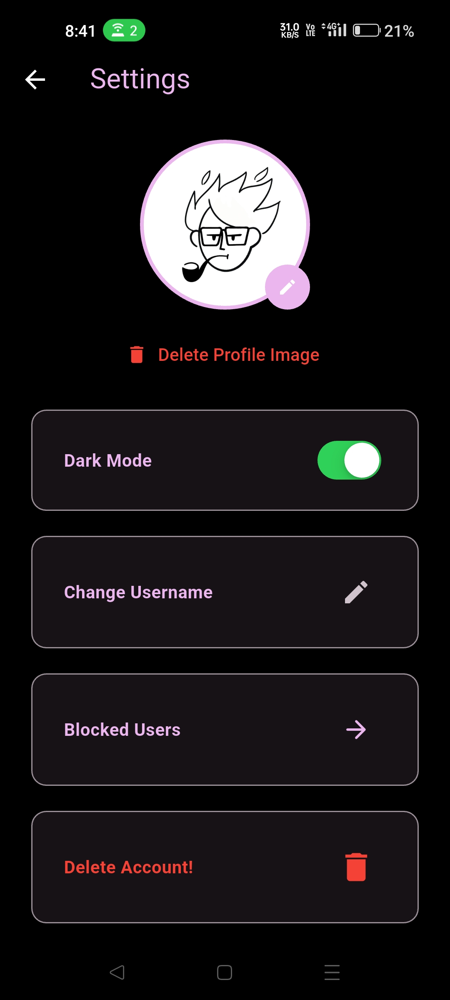 
      Dark Mode
    </td>
  </tr>
</table>

### 👥 Groups and Group List

<table>
  <tr>
    <td align="center">
      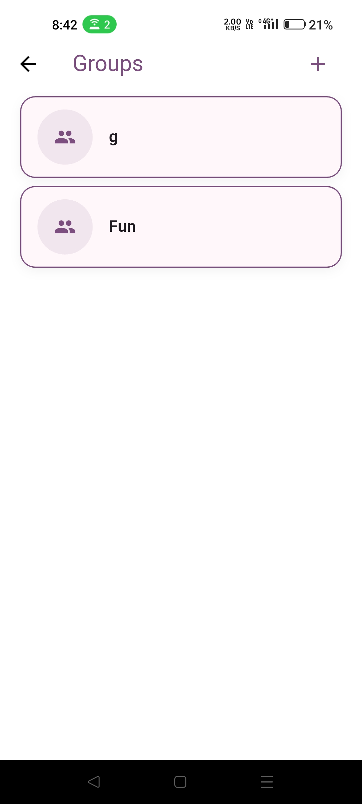 
      Group List
    </td>
    <td align="center">
      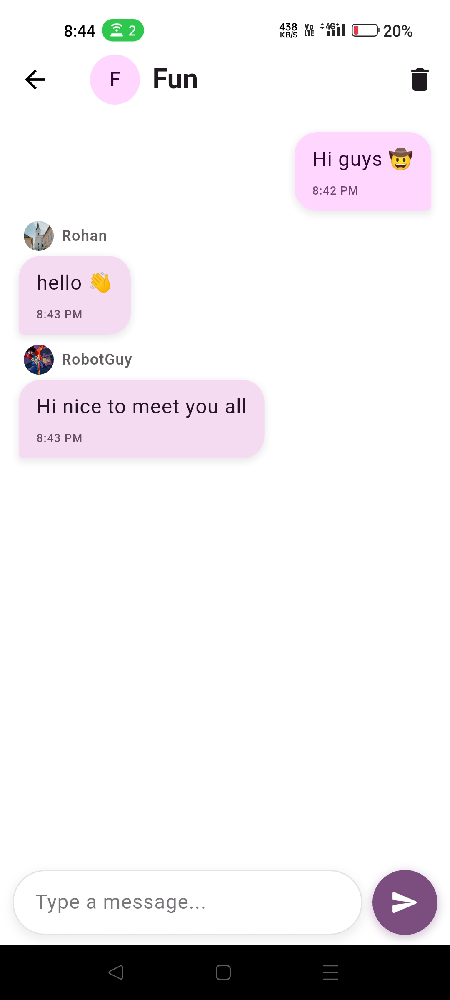 
      Group Chat
    </td>
  </tr>
</table>

> Note - More screenshots are available in the 'assets/screenshots' folder.
---
